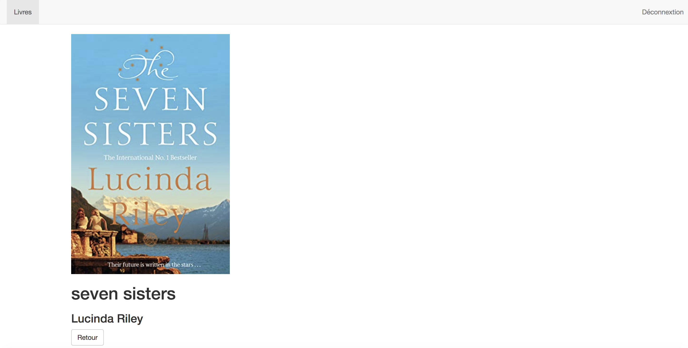

# Projet Bookshelf:

Technologies: angular5, Firebase, Bootstrap, CSS

Environnement: Mac OS

IDE: VS CODE

## 1. Create an account

Rules: a valid email  + password (at least 6 digits of numbers or/and letters )

Only if the rules are satisfaited, the button will be activated.

After creating an account, we can read the information of the account from Firebase.

## 2. Sign in: Firebase Authentication

## 3. Entre the page of bookshelf

## 4. Read the details of book chosen

## 5. Return to bookshelf and add new book

The buton will be activated only if the fields of title and author are filled . If the picture is sucessful uploaded, the page will display "Ficher chargé"

Now, we can see that the new book is sucessful inserted. 

And we can get its information from Firebase.

## 6. Remove the book from the bookshelf

Click on the Button "-" at the right of the name of each book, we can remove the related book. 

## 7. Sign out

click on the button "déconnexion" at the right of this page, we can sign out the account.

